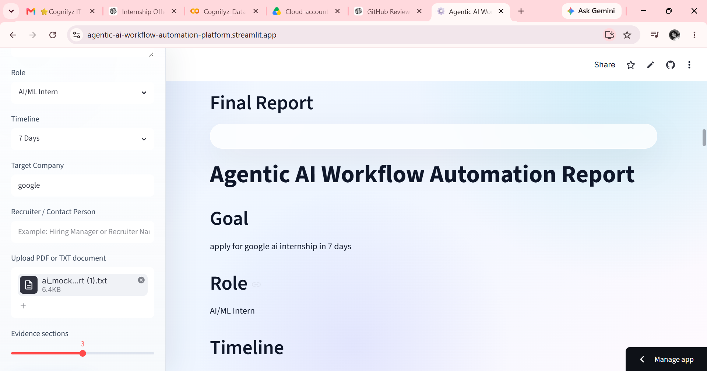
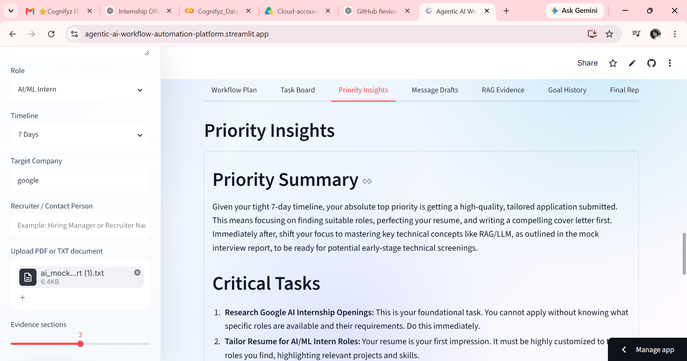
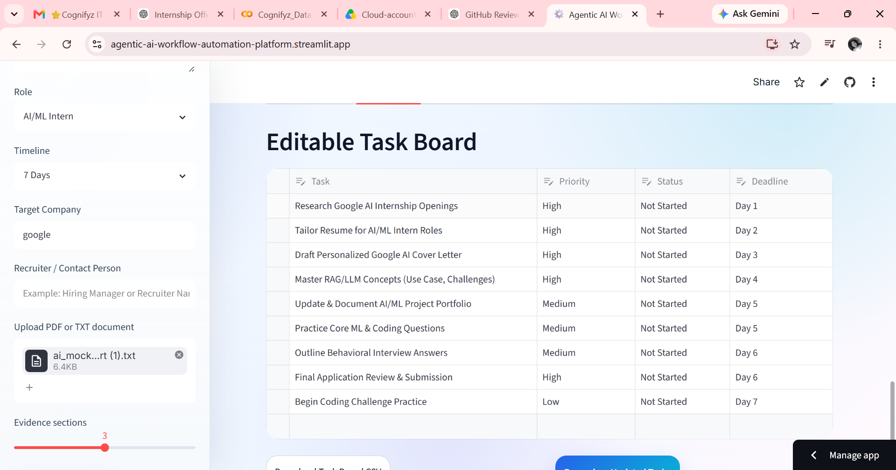
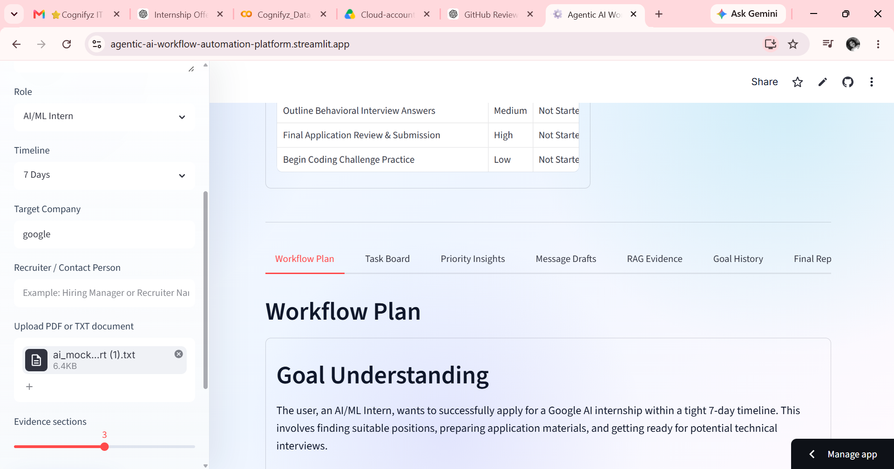
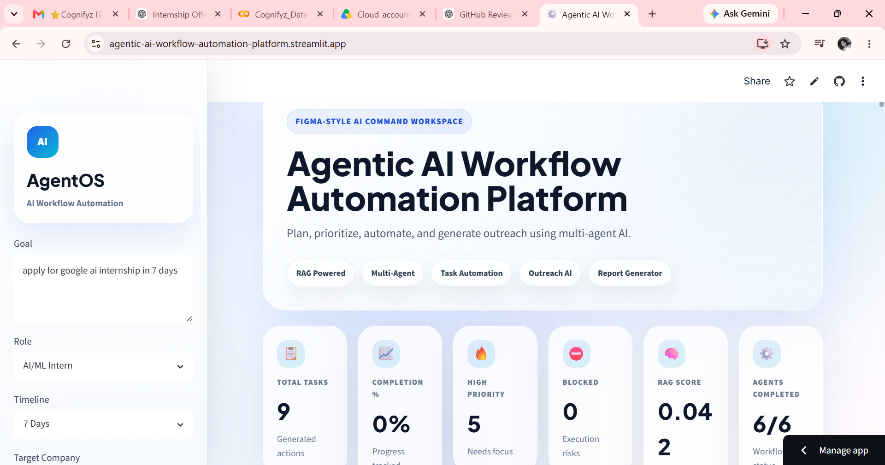

# Agentic AI Workflow Automation Platform

An advanced **Agentic AI + RAG-powered workflow automation platform** that converts user goals into structured action plans, editable task boards, priority insights, recruiter outreach messages, and downloadable workflow reports.

This project is built using **Python, Streamlit, Gemini API, RAG, PDF/TXT document processing, task analytics, and multi-agent AI workflows**.

---

## Live Demo

Add your deployed Streamlit link here:

```text
https://agentic-ai-workflow-automation-platform.streamlit.app/
```

---

## GitHub Repository

```text
https://github.com/joicyroslin-svg/Agentic-AI-Workflow-Automation-Platform
```

---

## Project Overview

The **Agentic AI Workflow Automation Platform** helps users convert any goal into a clear execution workflow.

The user enters a goal, selects their role and timeline, optionally uploads a PDF/TXT document, and the app uses multiple AI agents to generate a complete automation plan.

Example goal:

```text
Prepare and apply for Google AI Internship in 7 days
```

The platform then generates:

* Workflow plan
* Task checklist
* Priority analysis
* Recruiter email draft
* LinkedIn message draft
* Follow-up message
* RAG evidence summary
* Final downloadable automation report

---

## Why This Project?

Most AI tools only generate text. This project goes beyond simple text generation by combining:

* Multi-agent AI workflow
* RAG-based context retrieval
* Goal planning
* Task automation
* Priority intelligence
* Outreach message generation
* Analytics dashboard
* Downloadable reports

This makes the project useful for real-world productivity, internship/job preparation, project planning, and workflow automation.

---

## Key Features

### Goal-to-Workflow Planning

The user enters a goal, and the Planner Agent converts it into a structured action plan.

### RAG-Based Document Context

Users can upload a PDF or TXT document. The app extracts text, splits it into chunks, retrieves relevant sections, and uses them as context.

### Multi-Agent Workflow

The platform uses multiple specialized agents:

* RAG Engine
* Planner Agent
* Task Agent
* Priority Agent
* Message Agent
* Final Report Generator

### Editable Task Board

The Task Agent creates a task checklist with:

* Task name
* Priority
* Status
* Deadline

The user can edit task status and priority directly in the app.

### Priority Analysis

The Priority Agent analyzes tasks and gives:

* Critical tasks
* Blocker risks
* Time management plan
* Completion strategy
* Next best action

### Outreach Message Generation

The Message Agent generates:

* Recruiter email
* LinkedIn connection note
* LinkedIn DM
* Follow-up message
* Short self-introduction
* Message improvement tips

### Analytics Dashboard

The dashboard includes:

* Total tasks
* Completion percentage
* High-priority tasks
* Blocked tasks
* RAG confidence score
* Agents completed
* Task status chart
* Priority distribution chart
* Deadline load chart

### Downloadable Reports

Users can download:

* Workflow plan
* Task board CSV
* Priority insights
* Message drafts
* Final automation report

### Professional UI/UX

The app uses a modern Figma-style SaaS dashboard design with:

* Clean light mode UI
* Bento grid layout
* Rounded cards
* Soft gradients
* Agent workflow timeline
* Professional analytics panels
* Streamlit dashboard layout

---

## AI Agents Used

### 1. RAG Engine

The RAG Engine retrieves useful document context from uploaded PDF/TXT files.

It helps the app generate more personalized and context-aware outputs.

### 2. Planner Agent

The Planner Agent understands the user goal and creates a structured workflow plan.

It generates:

* Goal understanding
* Main objective
* Task breakdown
* Priority plan
* Suggested timeline
* Tools needed
* Risks
* Next best action

### 3. Task Agent

The Task Agent converts the workflow plan into an editable task board.

It creates tasks with:

* Priority
* Status
* Deadline

### 4. Priority Agent

The Priority Agent analyzes the generated task board and gives execution guidance.

It identifies:

* Most important tasks
* Blockers
* Time management strategy
* Completion plan

### 5. Message Agent

The Message Agent generates professional communication drafts.

It creates:

* Recruiter email
* LinkedIn connection request
* LinkedIn message
* Follow-up message
* Self-introduction

### 6. Final Report Generator

The final report combines all outputs into one complete workflow automation report.

---

## Tech Stack

| Category                 | Technology                 |
| ------------------------ | -------------------------- |
| Programming Language     | Python                     |
| Frontend / App Framework | Streamlit                  |
| Generative AI            | Gemini API                 |
| RAG Retrieval            | TF-IDF + Cosine Similarity |
| Document Processing      | PDFPlumber                 |
| Data Handling            | Pandas                     |
| Charts                   | Plotly                     |
| Environment Variables    | python-dotenv              |
| Deployment               | Streamlit Cloud            |
| Version Control          | Git & GitHub               |

---

## How It Works

```text
User enters goal
        ↓
User optionally uploads PDF/TXT document
        ↓
App extracts document text
        ↓
Document is split into chunks
        ↓
RAG Engine retrieves relevant chunks
        ↓
Planner Agent creates workflow plan
        ↓
Task Agent creates editable task board
        ↓
Priority Agent analyzes execution risks
        ↓
Message Agent creates outreach drafts
        ↓
Final report is generated and downloadable
```

---

## Project Architecture

```text
Agentic-AI-Workflow-Automation-Platform/
│
├── app.py
├── requirements.txt
├── README.md
├── .gitignore
├── .env
│
├── utils/
│   ├── agents.py
│   ├── document_reader.py
│   └── rag_engine.py
│
└── screenshots/
    ├── dashboard.png
    ├── agent-timeline.png
    ├── task-board.png
    ├── priority-insights.png
    ├── message-drafts.png
    └── final-report.png
```

---

## Folder Explanation

### `app.py`

Main Streamlit application file.

It handles:

* UI layout
* Sidebar inputs
* Dashboard metrics
* Agent workflow execution
* Charts
* Tabs
* Downloads
* Final report generation

### `utils/agents.py`

Contains AI agent functions:

* Planner Agent
* Task Agent
* Priority Agent
* Message Agent
* Gemini API connection logic

### `utils/document_reader.py`

Handles document reading.

It includes:

* PDF text extraction
* TXT text extraction
* Text chunking

### `utils/rag_engine.py`

Handles RAG retrieval.

It includes:

* Similarity-based chunk retrieval
* Context combination
* RAG confidence calculation

### `requirements.txt`

Contains all required Python packages.

### `.env`

Stores the Gemini API key locally.

This file should not be pushed to GitHub.

---

## Screenshots

Add your project screenshots here after uploading them to the `screenshots/` folder.

### Dashboard

```markdown

```

### Agent Timeline

```markdown

```

### Task Board

```markdown

```

### Priority Insights

```markdown

```

### Message Drafts

```markdown

```

### Final Report

```markdown

```

---

## Installation

### 1. Clone the Repository

```bash
git clone https://github.com/joicyroslin-svg/Agentic-AI-Workflow-Automation-Platform.git
```

### 2. Move Into the Project Folder

```bash
cd Agentic-AI-Workflow-Automation-Platform
```

### 3. Create Virtual Environment

```bash
python -m venv .venv
```

### 4. Activate Virtual Environment

For Windows:

```bash
.venv\Scripts\activate
```

For macOS/Linux:

```bash
source .venv/bin/activate
```

### 5. Install Requirements

```bash
pip install -r requirements.txt
```

---

## Environment Variables

Create a `.env` file in the project root folder.

```env
GEMINI_API_KEY=your_gemini_api_key_here
```

Do not upload the `.env` file to GitHub.

---

## Run Locally

```bash
python -m streamlit run app.py
```

---

## Streamlit Cloud Deployment

1. Push the project to GitHub.
2. Go to Streamlit Cloud.
3. Create a new app.
4. Select the GitHub repository.
5. Set the main file path as:

```text
app.py
```

6. Add this in Streamlit secrets:

```toml
GEMINI_API_KEY = "your_real_gemini_api_key_here"
```

7. Deploy the app.

---

## Requirements

```txt
streamlit
google-genai
python-dotenv
pandas
plotly
pdfplumber
scikit-learn
```

---

## Example Use Case

### Input

```text
Goal: Prepare and apply for Google AI Internship in 7 days
Role: AI/ML Intern
Timeline: 7 Days
Target Company: Google
Recruiter / Contact Person: Hiring Manager
```

### Output

The platform generates:

* 7-day workflow plan
* AI-generated task board
* Priority analysis
* Recruiter email draft
* LinkedIn connection note
* LinkedIn DM
* Follow-up message
* RAG evidence summary
* Final downloadable automation report

---

## Sample Output Sections

### Workflow Plan

```text
Goal Understanding
Main Objective
Task Breakdown
Priority Plan
Suggested Timeline
Tools Needed
Possible Risks
Next Best Action
```

### Task Board

```text
Task | Priority | Status | Deadline
Update resume | High | Not Started | Day 1
Improve LinkedIn profile | High | Not Started | Day 1
Prepare recruiter message | Medium | Not Started | Day 2
```

### Priority Insights

```text
Priority Summary
Critical Tasks
Blocker Risk
Time Management Plan
Completion Strategy
Next Best Action
```

### Message Drafts

```text
Recruiter Email
LinkedIn Connection Note
LinkedIn DM After Connection
Follow-Up Message
Short Self-Introduction
Message Improvement Tips
```

---

## What I Learned

Through this project, I learned:

* How to build Agentic AI workflows
* How to use Gemini API in a real application
* How to create multiple AI agents
* How RAG improves AI output using document context
* How to extract and process PDF/TXT documents
* How to build editable task boards in Streamlit
* How to create task analytics using Plotly
* How to generate professional outreach messages using AI
* How to create downloadable reports
* How to design a portfolio-ready Streamlit dashboard

---

## Resume Description

```text
Agentic AI Workflow Automation Platform — Built and deployed a GenAI-powered workflow automation platform using Gemini API, Streamlit, and RAG to convert user goals into structured action plans. Implemented Planner Agent, Task Agent, Priority Agent, and Message Agent for task planning, priority analysis, outreach message generation, progress tracking, and downloadable workflow reports.
```

---

## Resume Bullet Points

* Built and deployed a GenAI-powered workflow automation platform using Gemini API, Streamlit, and RAG to convert user goals into structured action plans.
* Implemented a multi-agent workflow with Planner Agent, Task Agent, Priority Agent, and Message Agent for planning, task generation, prioritization, and outreach automation.
* Added PDF/TXT document upload, RAG-based context retrieval, editable task board, task analytics, RAG confidence scoring, and downloadable final reports.
* Designed a professional Figma-style Streamlit dashboard with workflow timeline, bento metrics, analytics charts, task board, RAG evidence, and report generation.

---

## LinkedIn Project Description

```text
Built and deployed an Agentic AI Workflow Automation Platform that converts user goals into structured action plans using multiple AI agents.

The platform includes goal planning, RAG-based document context retrieval, AI-generated task boards, priority analysis, recruiter email drafting, LinkedIn outreach message generation, progress analytics, and downloadable workflow reports.

Tech Stack: Python, Streamlit, Gemini API, RAG, PDFPlumber, scikit-learn, Pandas, Plotly, GitHub, Streamlit Cloud.
```

---

## Future Improvements

* Add user authentication
* Save workflows permanently in a database
* Add calendar integration
* Add email sending after user approval
* Add Kanban board view
* Add voice input for goals
* Add multi-document RAG
* Add workflow templates
* Add export to PDF
* Add integration with Google Drive or Notion

---

## Author

**Joicy Roslin Sodadasi**

* GitHub: [joicyroslin-svg](https://github.com/joicyroslin-svg)
* LinkedIn: [Joicy Roslin Sodadasi](https://www.linkedin.com/in/joicy-roslin-sodadasi)

---

## License

This project is open-source and available under the MIT License.
